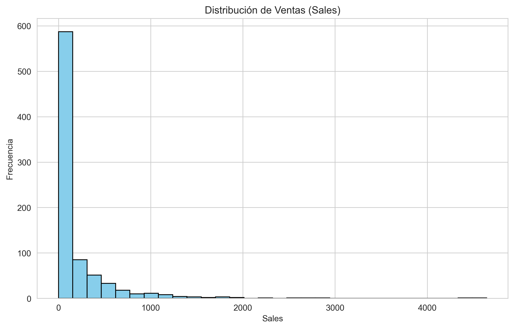
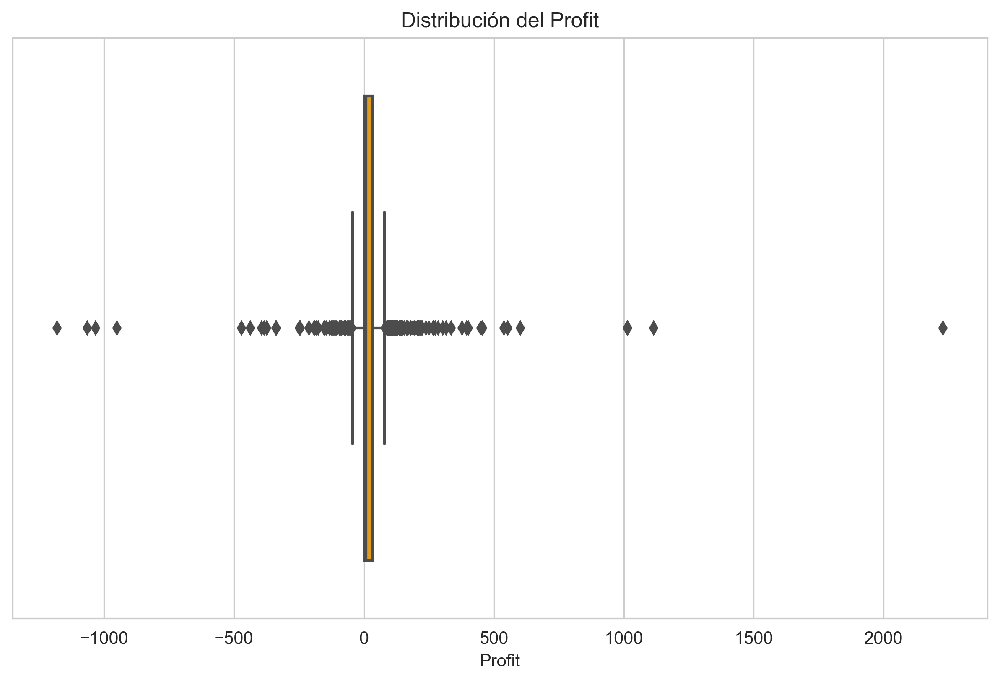
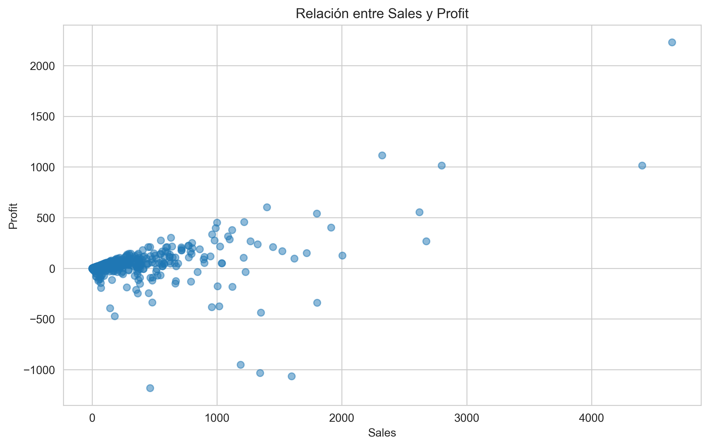
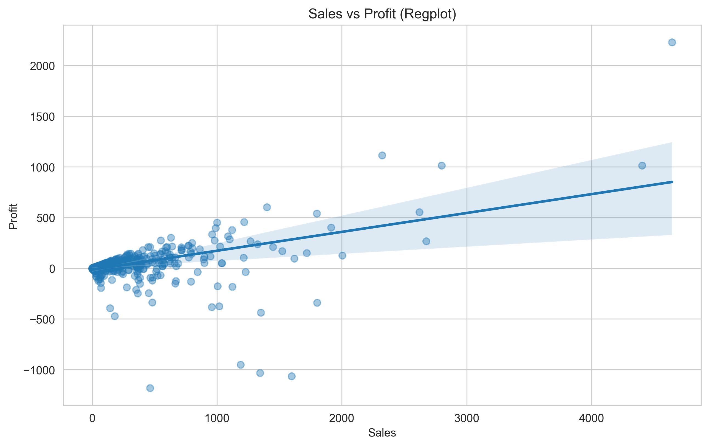
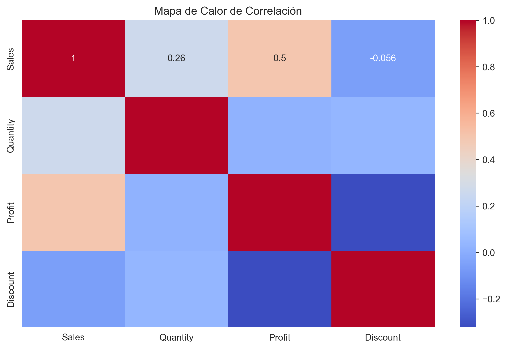
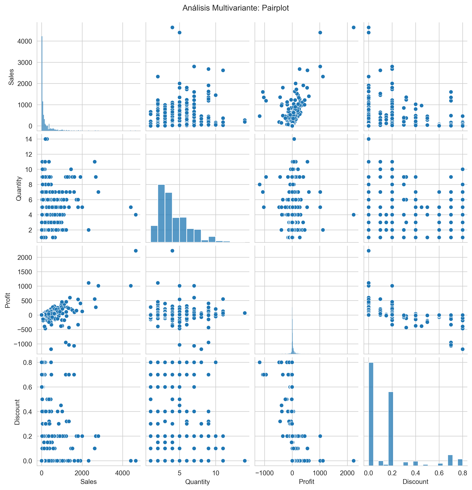
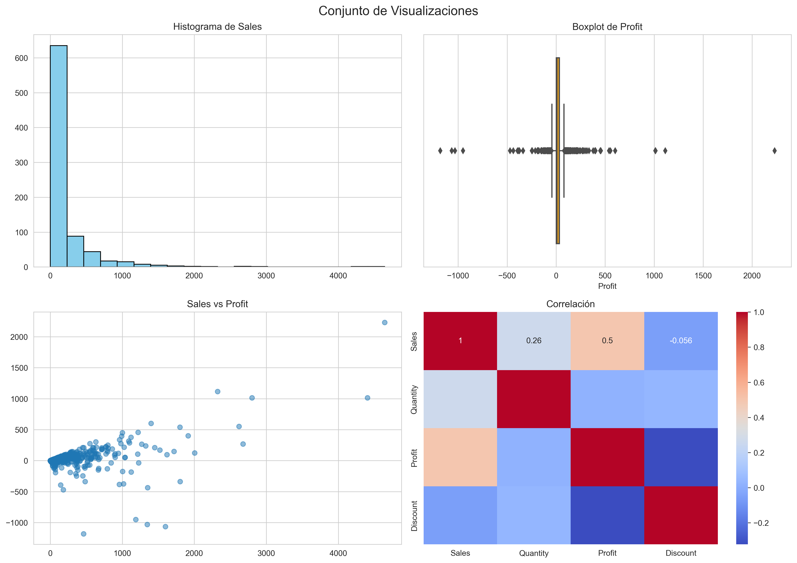
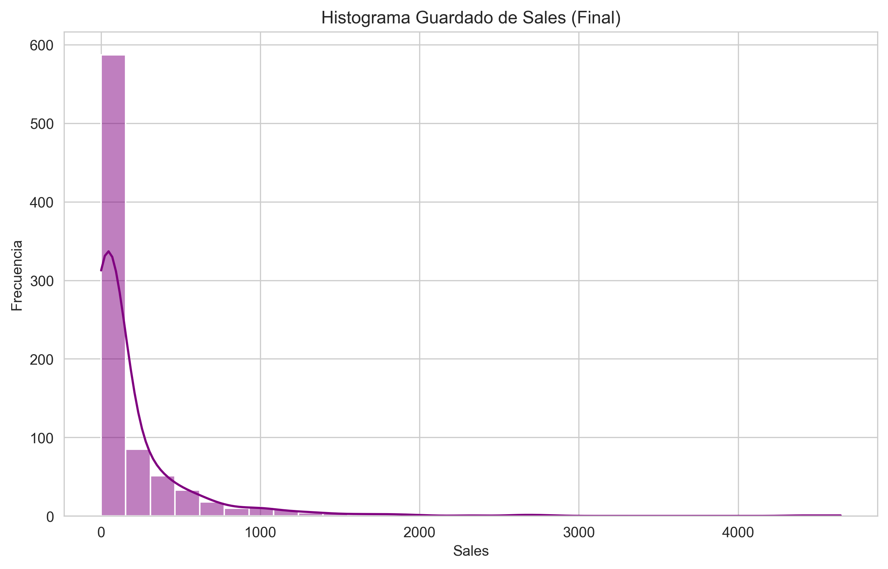

# 📈 Superstore Data Visualization Dashboard

This project generates a comprehensive set of visualizations using the **Superstore 2012** dataset and the libraries **Matplotlib** and **Seaborn**.  
All figures are automatically saved as PNG files and included in the repository.

---

## 📊 Visualizations Included

### ✔ Univariate Analysis (Matplotlib)
#### Histogram – Sales  


---

### ✔ Univariate Analysis (Seaborn)
#### Boxplot – Profit  


---

### ✔ Bivariate Analysis (Matplotlib)
#### Scatter Plot – Sales vs Profit  


---

### ✔ Bivariate Analysis (Seaborn)
#### Regplot – Sales vs Profit  


---

### ✔ Multivariate Analysis
#### Correlation Heatmap  


#### Pairplot – Sales, Quantity, Profit & Discount  


---

### ✔ Dashboard (Subplots)
A 2×2 layout combining histogram, boxplot, scatter, and heatmap:



---

### ✔ Additional Visualization
#### Final Histogram (Seaborn)


---

## 📦 Project Files
- `Dashboards.py` — main script that generates all figures  
- `superstore_dataset2012.csv` — dataset used for the analysis  
- PNG visualizations stored in the repository root  

---

## ▶️ Requirements & How to Run

```bash
pip install pandas numpy matplotlib seaborn
python Dashboards.py
